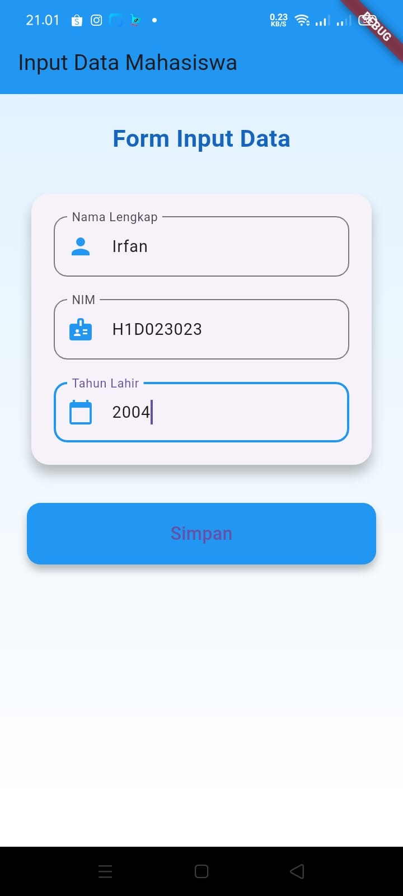
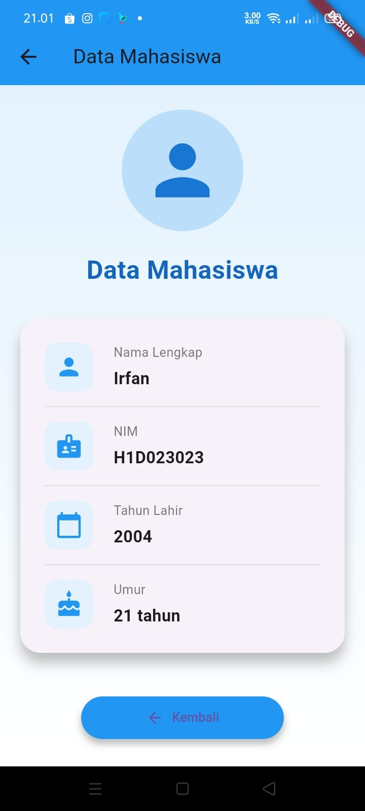

# 📱 H1D023023_Tugas6  

---
## Identitas
Nama  : Irfan Romadhon Widodo  
NIM   : H1D023023  
Shift : Shift D (Lama), Shift F (Baru)  

## 🧩 Deskripsi  
Proyek ini dibuat menggunakan **Flutter** untuk memenuhi tugas ke-6.  
Aplikasi ini menampilkan **form input data** yang diisi oleh pengguna, kemudian data tersebut dikirim (passing data) menuju halaman **tampilan hasil** untuk ditampilkan kembali di layar.

---

## 🛠️ Teknologi yang Digunakan  
- **Flutter & Dart**  
- (Tambahkan dependency yang digunakan di `pubspec.yaml`)  
- **Versi Flutter:** _(isi versi)_  
- **Platform Target:** Android / iOS  

---

## 🚀 Cara Menjalankan Aplikasi  

1. **Clone repositori**
   ```bash
   git clone https://github.com/IrfanRomadhonWidodo/H1D023023_Tugas6.git
   cd H1D023023_Tugas6
2. **Instal dependencies**
   ```bash
   flutter pub get
3. **Jalankan aplikasi**
   ```bash
   flutter run

---

## 🔄 Proses Passing Data dari Form Menuju Tampilan

Mekanisme utama pengiriman data dilakukan menggunakan **Constructor Parameter** saat berpindah halaman dengan `Navigator`.

### 1️⃣ Input Data pada Form

Pengguna mengisi data pada halaman form (`FormData`) menggunakan widget `TextFormField` yang dikontrol oleh `TextEditingController`.

```dart
final namaController = TextEditingController();
// Digunakan di: TextFormField(controller: _namaController, ...)
```
### 2️⃣ Mengambil Nilai Input

Ketika tombol submit ditekan, data diambil dari controller dan disimpan dalam variabel untuk diproses.

```dart
String nama = _namaController.text;
String nim = _nimController.text;
String tahunLahir = _tahunLahirController.text;
```
### 3️⃣ Navigasi ke Halaman Tampilan

Aplikasi berpindah ke halaman lain (TampilData) sambil mengirim data tersebut melalui argumen konstruktor di dalam MaterialPageRoute.

```dart
Navigator.push(
  context,
  MaterialPageRoute(
    builder: (context) => TampilData(
      nama: nama, 
      nim: nim,
      tahunLahir: tahunLahir,
    ),
  ),
);
```
### 4️⃣ Menerima Data di Halaman Tujuan

Halaman TampilData menerima data melalui constructor-nya dan menyimpannya dalam variabel final untuk ditampilkan.

```dart
class TampilData extends StatelessWidget {
  final String nama;
  // ... dan variabel lainnya

  const TampilData({required this.nama, required this.nim, required this.tahunLahir});

  @override
  Widget build(BuildContext context) {
    // Digunakan untuk menampilkan atau memproses:
    // child: Text('Halo, $nama'),
  }
}
```
### 5️⃣ Menampilkan Hasil

Nilai yang dikirim dari halaman form akan muncul di halaman tampilan (TampilData), menandakan bahwa proses passing data berhasil dilakukan.

## 📂 Struktur Folder (Singkat)

```bash
lib/
│
├── main.dart             # Entry point aplikasi
└── ui/
    ├── form_data.dart    # Halaman input data (FormData)
    └── tampil_data.dart  # Halaman menampilkan data hasil input (TampilData)
```

## 🖼️ Output/Tampilan Aplikasi

| Halaman Form Input | Hasil Tampilan Data |
|-------------------|-------------------|
|  |  |


